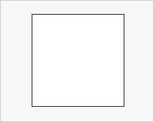
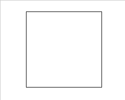
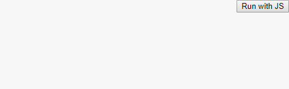
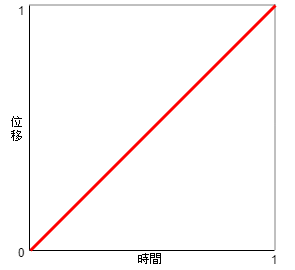

# CSS Animation 輕鬆起手式

最近無聊想把W3School的CSS練習全跑一輪，後面快到底剛好看到一個`CSS Animation`，哇原來CSS也能設定一波，當然是看個。

## 首先，怎麼用

要開頭用到動畫，當然是要給他在需要動畫的地方加上程式碼啦，例如加在一個區塊裡就會長成這樣:

```css
div{
    animation-name : anima_name ;
    animation-duration : 10s ;
}
```

一看直接頭疼，取名這種字串不是要給`""`嗎?還有後面那個`duration`是什麼東西?

當我們要進行動畫特效，也是需要寫個function去連結，`animation-name`自然是放那個函數的名字。而`animation-duration`指的是動畫的持續持間。

## Keyframes 關鍵影格

聽起來就是~~曾經用過的FLASH裡會有的東西~~，使用方法跟Javascript有87分像，但他的基本用法是:

```css
@keyframes anima_name{...}
```

跟RWD常用的`@media`差不多，這是宣告要使用**關鍵影格**用的，後面的`anima_name`就可以連結在要用的地方啦。

裡面會用到的基本用法有以下兩種:

### From to
從A到B的寫法，簡單二元的變動方式:
```css
@keyframes test{
    from {...}
    to {...}
}
```

舉個例子，當我要讓一個區塊用3秒從白變黑，就可以寫成:

```css
<!-- 區塊設定動畫 -->
div{
    animation-name: test1 ;
    animation-duration: 3s;
}
```
```css
<!-- 設定關鍵影格 -->
@keyframes test1{
    from {
        background:#FFF;
    }
    to{
        background:#000;
    }
}
```
那麼結果就會像這樣



### 0% ~ 100%

將動畫時間用`%`去切開分別設定，當動畫不是這麼單純的時候可以用這個，設定方法是:
```css
@keyframes test{
    0%{...}
    50%{...}
    100%{...}
}
```

一樣拿變色做範例，讓一個區塊在5秒從白到黑，中間穿插彩虹顏色:
```css
<!-- 區塊設定動畫 -->
div{
    animation-name: test2 ;
    animation-duration: 10s;
}
```
```css
<!-- 設定關鍵影格 -->
@keyframes test2{
    0%{background:#FFFFFF;}
    12.5%{background:#FF0000;}
    25%{background:#FF7F00;}
    37.5%{background:#FFFF00;}
    50%{background:#00FF00;}
    62.5%{background:#00FFFF;}
    75%{background:#0000FF;}
    87.5%{background:#8B00FF;}
    100%{background:#000000;}
}
```
那麼結果就會像這樣



說個不太重要的小事，其實`from`可以改成`0%`，`to`改成`100%`。

## 相關屬性

順手介紹一下跟動畫特效有關的屬性:

屬性                     |預設值  |簡單說明
:------------------------|:------|:---------------------------
animation-name           |-      |動畫特效名稱
animation-duration       |0      |此特效的持續時間
animation-delay          |0      |此特效的延遲播放時間
animation-direction      |normal |動畫播放方向，有個參數叫reverse，~~所謂的再生與逆再生~~
animation-iteration-count|1      |播放循環次數，要無限循環就給他`infinite`
animation-timing-function|ease   |動畫特效的加速度函式(好像可以回去看看JS說明(X))
animation-fill-mode      |none   |播放前後模式
animation-play-state     |running|動畫播放(`running`)/暫停(`paused`)

### animation-name

`animation-name`就是指這個動畫特效的名字。有趣的是，名稱可以不用字串包住，所以這樣下面三種打法都是沒有問題的:

```css
@keyframes 'test'{...}
@keyframes "test"{...}
@keyframes test{...}
```

另外，若想要特別用特殊字元，只要把名字包起來就可以了。

```css
@keyframes 'inline' {...}
@keyframes 'initial' { ... }
```

### animation-duration

這邊指的是播放**"一次"**動畫所需的時間，要加上使用時間的單位(s/ms)。

```css
div{
    animation-duration:20s;
    animation-duration:20000ms; 
    /* 20000毫秒，也是20秒 */
}
```

### animation-delay 

這是指這個動畫**要等多久後才開始播放**，要加上使用時間的單位(s/ms)。

```css
div{
    animation-delay:2s;
    animation-delay:2000ms; 
    /* 2000毫秒，也是2秒 */
}
```

不過有趣的是，這邊若直接給他負值，就會直接跳到**扣除動畫持續的時間**(也就是`animation-duration`)。

看不懂沒關係，假如我給了10秒的動畫，卻在`animation-delay`給了他`-2s`，那就會直接掉前面那兩秒，從第二秒開始播放。

舉個例子，我們給了上面的彩虹變色例子，讓背景用8秒時間變化，設定成:

```css
@keyframes test{
    0%{background:#FFFFFF;}
    12.5%{background:#FF0000;}
    25%{background:#FF7F00;}
    37.5%{background:#FFFF00;}
    50%{background:#00FF00;}
    62.5%{background:#00FFFF;}
    75%{background:#0000FF;}
    87.5%{background:#8B00FF;}
    100%{background:#000000;}
}

div{
  animation-name: test;
  animation-duration: 8s;
}
```

一開始的結果大概是



假如這個時候給他delay了-4秒，就會:

```css
div{
  animation-name: test;
  animation-duration: 8s;
  animation-delay: -4s;
}
```

再來看看動畫，你會發現突然從綠色開始變色


### animation-direction

這是指動畫的播放方向，參數有下面四個:
* normal：正常播放 `0% >>> 100%`
* reverse：反轉播放，也就是所謂的逆再生 `100% >>> 0%`
* alternate：先正再反，輪流播放  `0% >>> 100% >>> 0%`
* alternate-reverse： 先反再正，輪流播放 `100% >>> 0% >>> 100%`

這邊要注意的是，`alternate`和`alternate-reverse`假如上面設定的動畫播放次數只有一次(`animation-duration:1`)的話，那就只有正常播放(跟`normal`和`reverse`一樣)。

### animation-timing-function

這是對動畫進行加速度的函式，

