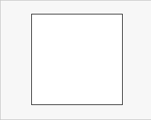
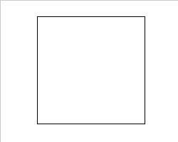

# CSS Animation 輕鬆起手式

最近無聊想把W3School的CSS練習全跑一輪，後面快到底剛好看到一個`CSS Animation`，哇原來CSS也能設定一波，當然是看個。

## 首先，怎麼用

要開頭用到動畫，當然是要給他在需要動畫的地方加上程式碼啦，例如加在一個區塊裡就會長成這樣:

```css
div{
    animation-name : anima_name ;
    animation-duration : 10s ;
}
```

一看直接頭疼，取名這種字串不是要給`""`嗎?還有後面那個`duration`是什麼東西?

當我們要進行動畫特效，也是需要寫個function去連結，`animation-name`自然是放那個函數的名字。而`animation-duration`指的是動畫的持續持間。

注意的是，名稱可以不用字串包住。

順手介紹一下跟動畫特效有關的屬性:

屬性                     |預設值  |簡單說明
:------------------------|:------|:---------------------------
animation-name           |-      |動畫特效名稱
animation-duration       |0      |此特效的持續時間
animation-delay          |0      |此特效的延遲播放時間
animation-direction      |normal |動畫播放方向，有個參數叫reverse，~~所謂的再生與逆再生~~
animation-iteration-count|1      |播放循環次數，要無限循環就給他`infinite`
animation-timing-function|ease   |動畫特效的加速度函式(好像可以回去看看JS說明(X))
animation-fill-mode      |none   |播放前後模式
animation-play-state     |running|動畫播放(`running`)/暫停(`paused`)

## Keyframes 關鍵影格

聽起來就是~~曾經用過的FLASH裡會有的東西~~，使用方法跟Javascript有87分像，但他的基本用法是:

```css
@keyframes anima_name{...}
```

跟RWD常用的`@media`差不多，這是宣告要使用**關鍵影格**用的，後面的`anima_name`就可以連結在要用的地方啦。

裡面會用到的基本用法有以下兩種:

### From to
從A到B的寫法，簡單二元的變動方式:
```css
@keyframes test{
    from {...}
    to {...}
}
```

舉個例子，當我要讓一個區塊用3秒從白變黑，就可以寫成:

```css
<!-- 區塊設定動畫 -->
div{
    animation-name: test1 ;
    animation-duration: 3s;
}
```
```css
<!-- 設定關鍵影格 -->
@keyframes test1{
    from {
        background:#FFF;
    }
    to{
        background:#000;
    }
}
```
那麼結果就會像這樣



### 0% ~ 100%

將動畫時間用`%`去切開分別設定，當動畫不是這麼單純的時候可以用這個，設定方法是:
```css
@keyframes test{
    0%{...}
    50%{...}
    100%{...}
}
```

一樣拿變色做範例，讓一個區塊在5秒從白到黑，中間穿插彩虹顏色:
```css
<!-- 區塊設定動畫 -->
div{
    animation-name: test2 ;
    animation-duration: 10s;
}
```
```css
<!-- 設定關鍵影格 -->
@keyframes test2{
    0%{background:#FFFFFF;}
    12.5%{background:#FF0000;}
    25%{background:#FF7F00;}
    37.5%{background:#FFFF00;}
    50%{background:#00FF00;}
    62.5%{background:#00FFFF;}
    75%{background:#0000FF;}
    87.5%{background:#8B00FF;}
    100%{background:#000000;}
}
```
那麼結果就會像這樣



說個不太重要的小事，其實`from`可以改成`0%`，`to`改成`100%`。